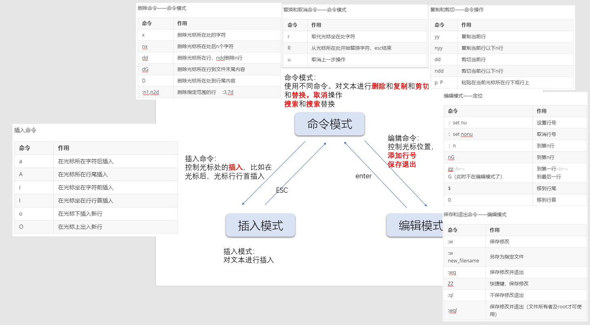

**远程登陆管理工具**

虚拟机通过假网卡。桥接使用真实网卡（桥接有线，桥接无线），他可以和局域网的其他主机可以通信。

Host-only：只能和主机通信

NAT：只能和主机通信，还有和共享主机通信。

配置linux IP命令

`ifconfig eth0 192.168.1.156`

# 远程登陆

## ssh

**远程登陆**

`ssh -p 22 user@host`

```shell
[root@VM-0-7-centos ~]# ssh -p 22 root@139.155.73.140

The authenticity of host '139.155.73.140 (139.155.73.140)' can't be established.
ECDSA key fingerprint is SHA256:fsCCE9M7ZIuVypDJRezvTPj9aOv4CQ5/A2igtlEqWok.
ECDSA key fingerprint is MD5:2f:7e:e6:5b:c8:04:22:b0:42:8d:02:b9:a4:22:1a:37.
Are you sure you want to continue connecting (yes/no)? yes

Warning: Permanently added '139.155.73.140' (ECDSA) to the list of known hosts.
root@139.155.73.140's password: 

Last failed login: Wed Mar 10 13:49:10 CST 2021 from 103.219.112.63 on ssh:notty
There were 108 failed login attempts since the last successful login.
Last login: Wed Mar 10 13:28:26 2021 from 116.236.224.254

```

## scp

`scp -p22 -r -p /file user@host:/file`

`scp user@host:/file /dir`

scp是远程拷贝，cp是本地拷贝。

scp每次都是全量拷贝，增量拷贝是rsync

## ssh后台相关服务

- 查询openssl软件

  `rpm -qa openssh openssl`

- 查询sshd进程

  `ps -ef |grep ssh`

- 查看ssh端口

  ```shell
  netstat -lntup | grep ssh  
  ss | grep ssh               
  netstat -a | grep ssh
  ```

- ssh密钥目录

  `ll /root/.ssh/known_hosts`

- ssh的配置文件

  `cat /etc/ssh/sshd_config`

- ssh服务关闭

  `service sshd stop`

- ssh服务开启

  `service sshd start`

- ssh服务重启

  `service sshd reload` 	//停止进程后重启

  `service sshd restart`

- ssh远程登陆

  `ssh host`	用当前宿主用户的用户名登陆

  `ssh user@host`	远程机的用户登陆

  `ssh user@host -o stricthostkeychecking=no`	首次登陆免yes

  `ssh user@host "ls /file"`	登陆后执行某个命令

[参考](https://blog.csdn.net/cgy8919/article/details/88759663?utm_medium=distribute.pc_relevant.none-task-blog-baidujs_baidulandingword-1&spm=1001.2101.3001.4242)

# 常用命令

## 文件处理命令

### ls

所在路径： /bin/ls  

执行权限 ：所有用户

| 选项 | 含义                                       |
| ---- | ------------------------------------------ |
| -a   | 显示所有文件                               |
| -l   | 详细信息                                   |
| -d   | 查看目录                                   |
| -h   | 字节转换                                   |
| -i   | 查询文件inode号（inode存储文件的详细信息） |


```shell
[root@VM-0-7-centos home]# ls -i -l 
总用量 36
  1822 lrwxrwxrwx 1 root root   12 9月  25 21:33 b -> /home/bbbbbb
   954 -rw-r--r-- 1 root root    0 3月  10 14:15 bbbbbb
655807 drwxr-xr-x 2 root root 4096 3月  10 01:27 blog
656688 drwxr-xr-x 2 root root 4096 8月  21 2020 blogdev


```

### 用户组

- u 所有者【默认谁创建所有者就是他】
- g 所属组
- o 剩下的人

```shell
526278 drwx------ 2 lhj  lhj  4096 9月  27 23:26 lhj
  5461 -rw-r--r-- 1 root root 1125 9月  27 23:41 lhj1.zip
```

- l：链接	d：文件夹	-：文件
- 权限：-rw-r--r--。三个为一组，分别是所有者，所属组，其他人的权限。
- inode 权限 所有者 所属组 文件大小 最后修改时间 文件名

## 目录处理命令

### mkdir

命令路径：/bin/mkdir

执行权限：所有用户

| 选项 |          |
| ---- | -------- |
| -p   | 嵌套创建 |
| -m   | 设置权限 |

`mkdir -p  /h/h`

`mkdir /o`

### cd 跳转目录

~根目录

./当前目录

../上级目录

### pwd 显示当前目录

命令所在路径：/bin/pwd

执行权限：所有用户

`[root@VM-0-7-centos home]# cd xl`
`[root@VM-0-7-centos xl]# pwd
/home/xl`

### rmdir 删除空目录

命令所在路径：/bin/rmdir

执行权限：所有用户

只能删除空目录，目录里有文件或者文件夹都不行

|      |                    |
| ---- | ------------------ |
| -p   | 连同上级目录也删除 |


```shell
[root@VM-0-7-centos home]# mkdir test
[root@VM-0-7-centos home]# rmdir /home/test
[root@VM-0-7-centos home]# mkdir test
[root@VM-0-7-centos home]# cd test
[root@VM-0-7-centos test]# touch test.txt
[root@VM-0-7-centos test]# rmdir /home/test
rmdir: 删除 "/home/test" 失败: 目录非空
```

### cp 复制

命令所在路径：/bin/cp

执行权限：所有用户

`cp -选项 文件/目录/多个目录 目标目录`

选项

| 选项 |                                              |
| ---- | -------------------------------------------- |
| -r   | 复制目录，递归赋值                           |
| -p   | 文件属性也复制过去，比如不修改上次属性       |
| -d   | 如果复制的文件是链接形式，复制链接而非源文件 |
| -a   | -pdr                                         |
| -f   | 目标文件已存在，删除目标文件再复制           |
| -i   | 目标文件已存在，询问后再复制                 |

### rm 删除文件

命令所在路径:/bin/rm

执行权限:所有用户

|      |                                          |
| ---- | ---------------------------------------- |
| -f   | 强制删除，不出现警告信息，忽略不存在文件 |
| -i   | 删除前询问                               |
| -r   | 目录递归m删除                            |

### mv 剪切文件（修改名称）

命令所在路径:/bin/rm

执行权限:所有用户

|      |                                          |
| ---- | ---------------------------------------- |
| -f   | 强制删除，不出现警告信息，忽略不存在文件 |
| -i   | 移动前询问                               |

### 总结

|              |                               |
| ------------ | ----------------------------- |
| 创建文件夹   | mkdir path<br />mkdir -p path |
| 跳转目录     | cd  ~<br />cd ./a<br />cd ../ |
| 显示当前目录 | pwd                           |
| 删除空目录   | redir path                    |
| 复制         | cp  -选项   源 目的           |
| 剪切         | mv                            |

## 文件处理命令

### 查看文件内容

| 命令 | 选项                                                         | 解释                     |
| ---- | ------------------------------------------------------------ | ------------------------ |
| cat  | **cat -[abEntv] file**<br />-a = -vET<br />-b  行号，空白不算<br />-n  行号，空白也算<br />-T  tab以^I显示出来<br />-v  列出看不见的特殊字符<br />-E ：将结尾的断行字节 $ 显示出来 | 第一行开始看内容         |
| tac  | 同cat                                                        | 从最后一行看，文件倒着写 |
| nl   | **nl -[bnw] file**<br /><br />**-b<br />**-ba  等同于cat -n<br />-bt  等同于cat -b<br /><br />**-n**<br />-nln   行号再屏幕左边显示<br />-nrn   行号再栏位右边显示不加0<br />-nrz    行号再栏位右边显示加0<br /><br />**-w**：行号栏位的占用位数 | 行号                     |
| more | **more file**<br />按键：<br />q 离开<br />/str   向下找str，或者找不到模式<br />space：往下翻一页<br />enter：往下翻一行 | 一页一页显示             |
| less | **less file**<br />空白键    ：向下翻动一页；<br/>[pagedown]：向下翻动一页；<br/>[pageup]  ：向上翻动一页；<br/>/字串     ：向下搜寻『字串』的功能；<br/>?字串     ：向上搜寻『字串』的功能； | 比more多往前翻页         |
| head | **head [-n num] file**<br />默认10行                         | 只看头几行               |
| tail | **tail [-n number] file**<br />默认最后十行（还是顺序）      | 只看尾几行               |

less y


## Vim编辑命令



### 命令模式

删除命令——命令模式

| 命令    | 作用                         |
| ------- | ---------------------------- |
| x       | 删除光标所在处的字符         |
| nx      | 删除光标所在处后n个字符      |
| dd      | 删除光标所在行，ndd删除n行   |
| dG      | 删除光标所在行到文件末尾内容 |
| D       | 删除光标所在处到行尾内容     |
| :n1,n2d | 删除指定范围的行     :3,7d   |

复制和剪切——命令操作

| 命令       | 作用                         |
| ---------- | ---------------------------- |
| yy         | 复制当前行                   |
| nyy        | 复制当前行以下n行            |
| dd         | 剪切当前行                   |
| ndd        | 剪切当前行以下n行            |
| p  P       | 粘贴在当前光标所在行下或行上 |
| **v+上下** | **选中XX行**                 |

替换和取消命令——命令模式

| 命令 | 作用                              |
| ---- | --------------------------------- |
| r    | 取代光标坐在处字符                |
| R    | 从光标所在处开始替换字符，esc结束 |
| u    | 取消上一步操作                    |

搜索和搜索替换命令——命令模式

| 命令                 | 作用                                        |
| -------------------- | ------------------------------------------- |
| /string              | 搜索指定字符串<br>搜索时忽略大小写  :set ic |
| n                    | 搜索指定字符串的下一个出现位置              |
| :%s/old/new/g(c)     | 全文替换指定字符串   :%s/dddd/d/g           |
| :n1,n2s/old/new/g(c) | 在一定范围内替换指定字符串   :1,4s/dddd/d/g |

会询问确认

### 插入模式

插入命令

| 命令 | 作用                 |
| ---- | -------------------- |
| a    | 在光标所在字符后插入 |
| A    | 在光标所在行尾插入   |
| i    | 在光标坐在字符前插入 |
| I    | 在光标坐在行行首插入 |
| o    | 在光标下插入新行     |
| O    | 在光标上出入新行     |


### 编辑模式

编辑模式——定位

| 命令                          | 作用                   |
| ----------------------------- | ---------------------- |
| ：set nu                      | 设置行号               |
| ：set nonu                    | 取消行号               |
| ：n                           | 到第n行                |
| nG                            | 到第n行                |
| gg<br>G（此时不在编辑模式了） | 到第一行<br>到最后一行 |
| $                             | 移到行尾               |
| 0                             | 移到行首               |


保存和退出命令——编辑模式

| 命令            | 作用                                       |
| --------------- | ------------------------------------------ |
| :w              | 保存修改                                   |
| :w new_filename | 另存为指定文件                             |
| :wq             | 保存修改并退出                             |
| ZZ              | 快捷键，保存修改                           |
| :q!             | 不保存修改退出                             |
| :wq!            | 保存修改并退出（文件所有者及root才可使用） |


### 使用技巧

- `:r filename` 在光标处导入一个文件

- `:! 系统命令`在vim编辑模式下执行系统命令

  

- `:r! 系统命令` 把系统命令写入文件中


- 定义快捷键:**map 快捷键   触发命令**
  范例:: map ^P I#\<ESC>    ^p=ctrl+v+p==ctrl+p   跳到行首加#
  : map^B Ox 跳到行首删除行首

  :map ^H iabuuloou@aliyun.com

- 连续行注释:n1,n2s/^/#/g   ^表示行首   替换为的字符
  :n1,n2s/^#//g   取消注释
  :n1,n2s/^/\/\//g        :n1,n2s  /^/   \/   \/    /g

- 替换  ab  [o]  [n]

  :ab mymail samlee@lampbrother.net

**有些时候在重启服务器之后，定义的快捷键会消失，这时候我们需要在用户的家目录下写配置文件，保存快捷键**
**root用户在 /root/.vimrc
其他用户在 /home/username/.vimrc在里面进行编辑，永久生效**


## 压缩解压命令

| 命令   | 语法        | 选项 | 路径，权限                                      | 说明                                             | eg |
| ------ | ----------- |---------------| ----------------------------------------------- | ------------------------------------------------ | ---- |
| gzip   | gzip file   | 	|命令所在路径:/bin/gzip<br />执行权限:所有用户   | 压缩后源文件没了<br />只能压缩文件，不能压缩目录 |      |
| gunzip | gunzip file |	| 命令所在路径:/bin/gunzip<br />执行权限:所有用户 | 压缩后压缩文件不见了                             |      |
| tar    | tar  [-zcf] [压缩后文件名] [压缩文件目录] | -c打包<br/>-v显示详细信息<br/>-f指定文件名<br/>-z压缩<br /><br />**-cvf,-zcvf,jcvf** | 命令所在路径:/bin/tar<br />执行权限:所有用户 | 打包：多个文件变一个文件。该一个文件会大于整体所有文件,因为会添加各个信息说明哪到哪是一个文件.<br />压缩：大文件变小文件 | 单独打包：`tar -cvf path file`**后缀名是.tar**<br />houzhgzip压缩:`tar -zcvf path file`**后缀名是.tar.gz**<br />bzip2压缩:`tar -jcvf path file`后缀名是.tar.bz2 |
| tar解压 | 解包：-xcf<br />解包解压：-zxvf | -x   解包<br/>-v   显示详细信息<br/>-f   指定解压文件<br/>-z   解压缩 |  | 加了-v后，你在打包的时候就会输出被打包的文件的名字。<br />大写的-V的：V label-name。作用是给打好的包加上一个label<br />tar -V ppp -cf my.tar test/ | tar -zxvf test.tar.gz |
| zip | zip -r dfile sfile | -r：目录下的所有文件和子目录一并处理 |  | 保留源文件<br />压缩比不高<br />[选项参考](https://www.cnblogs.com/black-humor/p/8962499.html) | `zip -r hehe` |
| unzip |  |  |  |  | `unzip hehe` |
| bzip | bzip2 -k file | -k :保留源文件 |  | 保留源文件，压缩比高 | `bzip2 -k japan`<br />`tar -jcf japan.tar.bz2 japan` |
| bunzip2 | bunzip2 -k file | -k :保留源文件 |  |  | `bunzip2 -k japan.tar.bz2`<br />`tar -jxf japan.tar.bz2` |

### 总结

| 格式     | 压缩     | 解压            |
| -------- | -------- | --------------- |
| .gz      | gzip     | gunzip(gzip -d) |
| .tar     | tar -cf  | tar -xf         |
| .tar.gz  | tar -zcf | tar -zxf        |
| .zip     | zip -r   | unzip           |
| .bz2     | bzip2    | bunzip2         |
| .tar.bz2 | tar -cjf | tar -xjf        |

## 权限管理命令


### chmod

- 语法：`chmod	-R	 [{ugoa} {+-=} {rwx}] 	file`

  ​			`chmod 	-R 	xyz	file` 	xyz是ugo的权限

  ```shell
  chmod -R u+x xl.conf
  [root@VM-0-7-centos test]# ls
  test.txt
  [root@VM-0-7-centos test]# ls -l
  总用量 0
  -rw-r--r-- 1 root root 0 3月  11 10:59 test.txt
  [root@VM-0-7-centos test]# chmod u+x test.txt 
  [root@VM-0-7-centos test]# ls -l
  总用量 0
  -rwxr--r-- 1 root root 0 3月  11 10:59 test.txt
  
  
  chmod u=rwx,g=rwx test.txt 
  [root@VM-0-7-centos test]# ls -l
  总用量 0
  -rwxr--r-- 1 root root 0 3月  11 10:59 test.txt
  [root@VM-0-7-centos test]# ls -l
  总用量 0
  -rwxrwxr-- 1 root root 0 3月  11 10:59 test.txt
  
  
  chmod 777 test.txt 
  [root@VM-0-7-centos test]# ls -l
  总用量 0
  -rwxrwxr-- 1 root root 0 3月  11 10:59 test.txt
  [root@VM-0-7-centos test]# ls -l
  总用量 0
  -rwxrwxrwx 1 root root 0 3月  11 10:59 test.txt
  
  ```

- 权限的数字表示
  r ----4
  w ----2
  X----1

  rwXrW-r--
  7 6 4

- | 代表字符 | 权限     | 对文件的含义                                 | 对目录的含义                                        |
  | -------- | -------- | -------------------------------------------- | --------------------------------------------------- |
  | r        | 读权限   | 可以查看文件内容 可以cat/more/head/tail/less | 可以列出目录中的内容 可以ls                         |
  | w        | 写权限   | 可以修改文件内容 可以vim                     | 可以在目录中创建，删除文件 可以touch/mkdir/rmdir/rm |
  | x        | 执行权限 | 可以执行文件 可以script(脚本) command(命令)  | 可以进入目录 **可以cd**                             |

**删除一个文件的前提：对该文件所在的目录有写权限。**

目录的rx都有

### chown改变文件所有者

- 语法：`chown user dirname/filename`
- 只有root可以修改

### chgrp改变文件的所有组

- 语法：`chgrp group dirname/filename`

### umask显示，设置文件缺省权限

- 语法：`umask -S` 	以rwx形式显示**新建**文件缺省权限

  ```shell
  [root@VM-0-7-centos test]# umask -S
  u=rwx,g=rx,o=rx
  
  **文件的权限和目录的权限：默认文件的权限g和o比目录的少一个x，就是执行权限**
  ```

  **文件的权限和目录的权限：默认文件的权限g和o比目录的少一个x，就是执行权限**

- **umask 指令直接输入之后会显示 0022
  其中 0代表特殊权限**

  异或

  777 rwx rwx rwx
  022  ---   -w-  -w-
  —————————
  755 rwx r-x r-x 目录
          rw- r--  r--  文件

  

  **如果想把默认创建的文件改为700**

  700 rwx --- --- 目录
          rw-  --- --- 文件

  这样运算 进行逻辑与比对
  777 rwx rwx rwx
  077 ---    rwx rwx
  —————————
  700 rwx  ---    ---